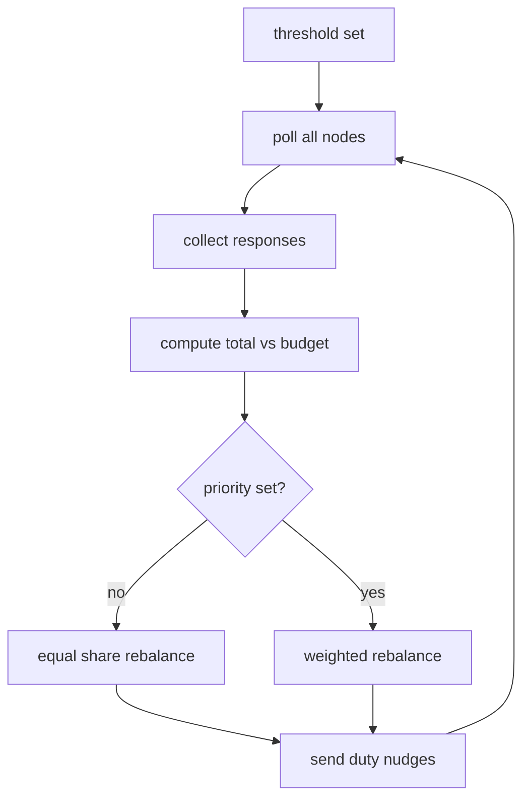

# PowerManager Flow

File focus: `gateway-pi5/gateway.py`

## What Triggers It

`threshold <mW>` command:

- `set_threshold()` at `:173`

## Main Loop

When active, PM repeatedly:

1. Poll all nodes (`ALL:READ`)
   - `_poll_all_nodes()` at `:412`
2. Wait for responses
   - `_wait_for_responses()` at `:424`
3. Mark stale nodes
   - `_mark_stale_nodes()` at `:439`
4. Evaluate total power vs budget
   - `_evaluate_and_adjust()` at `:452`
5. Nudge duties
   - `_nudge_node()` at `:578`
6. If priority set, use weighted split
   - `_balance_with_priority()` at `:639`

## Budget Logic

`budget = threshold - HEADROOM_MW`

`HEADROOM_MW` constant is in `PowerManager` settings.

## Why Three Duty Fields Matter

- `duty`: measured by sensor
- `target_duty`: user ceiling
- `commanded_duty`: last PM command confirmed

This avoids oscillation and protects user-intended limits.

## Diagram

