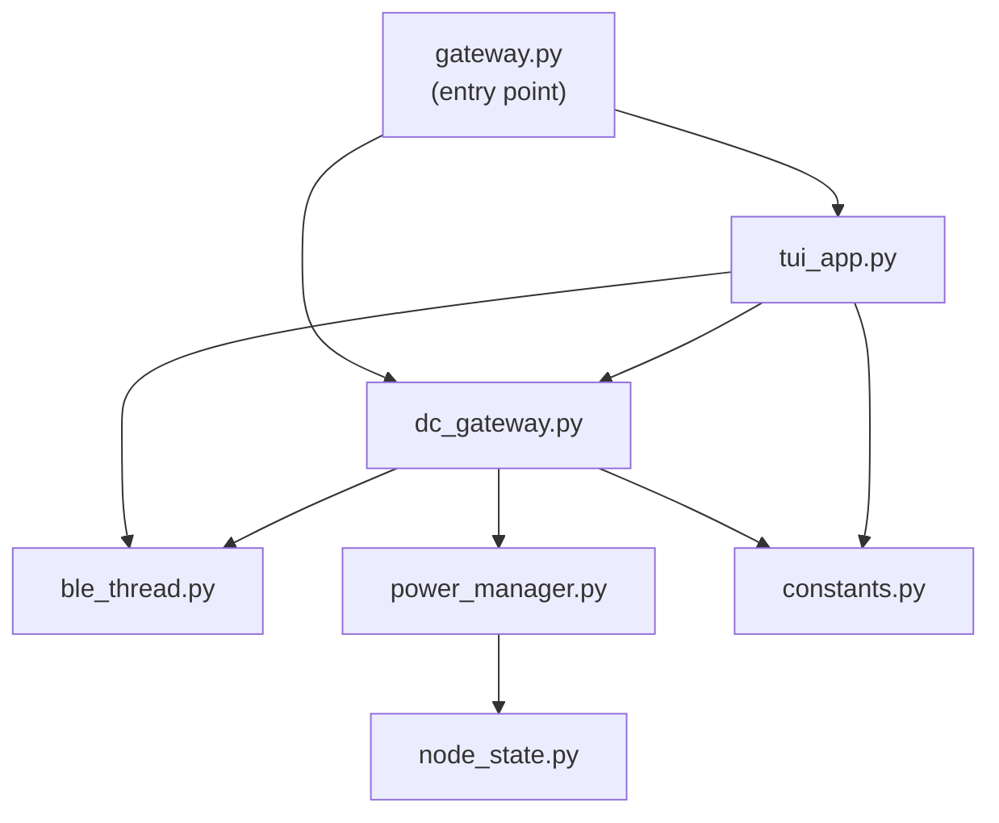

# v0.6.2 Python Gateway Modular Cleanup Plan

**Date:** February 25, 2026
**Author:** Justin Kwarteng
**Status:** Draft — Awaiting Review

---

## 1. Problem Statement

`gateway-pi5/test-13-tui.py` is a single 1,722-line Python file containing 4 classes, the TUI app, and CLI logic. While Python handles this better than C, it makes the code harder to navigate, test individually, and extend (the upcoming v0.7.0 failover adds more complexity).

## 2. Goal

Split into focused single-responsibility modules. Zero behavior changes.

## 3. Target File Structure

```
gateway-pi5/
  gateway.py          (~50 lines)   — entry point: main(), _run_cli(), argparse
  constants.py        (~25 lines)   — UUIDs, regex patterns, device name prefixes
  ble_thread.py       (~65 lines)   — BleThread class
  node_state.py       (~20 lines)   — NodeState dataclass
  power_manager.py    (~540 lines)  — PowerManager class
  dc_gateway.py       (~480 lines)  — DCMonitorGateway class
  tui_app.py          (~480 lines)  — MeshGatewayApp (Textual TUI)
  test-13-tui.py                    — DEPRECATED (kept for rollback reference)
```

## 4. Class-to-Module Mapping

| Class / Section | Current Lines | Target Module |
|---|---|---|
| Imports + constants | 1-65 | `constants.py` + each module's own imports |
| `BleThread` | 66-123 | `ble_thread.py` |
| `NodeState` | 126-138 | `node_state.py` |
| `PowerManager` | 141-680 | `power_manager.py` |
| `DCMonitorGateway` | 682-1161 | `dc_gateway.py` |
| `MeshGatewayApp` | 1168-1647 | `tui_app.py` |
| `main()` + `_run_cli()` | 1650-1722 | `gateway.py` |

## 5. Import Dependencies



No circular dependencies — imports flow one direction.

## 6. What Does NOT Change

- Zero behavior changes — every class does exactly what it did before
- ESP firmware — completely untouched
- BLE protocol — same UUIDs, same notification format
- TUI layout / commands — identical
- PowerManager algorithm — unchanged

## 7. Verification Plan

### Syntax Check

```bash
cd gateway-pi5
python -c "import py_compile; py_compile.compile('gateway.py', doraise=True); print('OK')"
```

### Import Check

```bash
python -c "from dc_gateway import DCMonitorGateway; from tui_app import MeshGatewayApp; print('All imports OK')"
```

### Functional Test (Manual — on Pi 5)

1. Copy all new files to Pi 5
2. Run `python gateway.py` — TUI should launch identically
3. Connect to gateway, send `read`, `duty 50`, `stop` — all should work
4. Run `python gateway.py --no-tui` — legacy CLI should work
5. Run `python gateway.py --scan` — should list devices

## 8. Rollback

The original `test-13-tui.py` is kept as-is for reference. To rollback: `cp test-13-tui.py gateway.py`.
