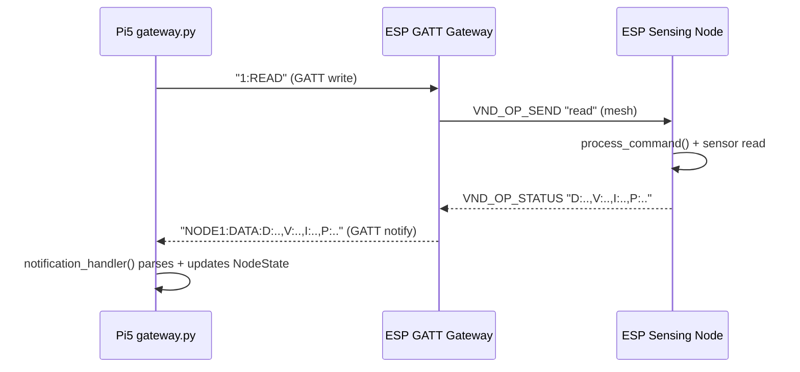

# End-to-End READ Flow

This is the most important flow to master first.

## Step-by-Step

1. Pi sends command string:
   - `gateway-pi5/gateway.py:929`
2. GATT gateway parses command:
   - `ESP/ESP_GATT_BLE_Gateway/main/main.c:563`
3. GATT gateway sends vendor mesh command:
   - `ESP/ESP_GATT_BLE_Gateway/main/main.c:353`
4. Sensing node receives and executes:
   - `ESP/ESP-Mesh-Node-sensor-test/main/main.c:597`
   - `ESP/ESP-Mesh-Node-sensor-test/main/main.c:363`
5. Sensing node responds with vendor status:
   - `ESP/ESP-Mesh-Node-sensor-test/main/main.c:597`
6. GATT gateway forwards response to Pi as notify:
   - `ESP/ESP_GATT_BLE_Gateway/main/main.c:222`
7. Pi parses and updates state/UI:
   - `gateway-pi5/gateway.py:760`

## Diagram

## What to Verify in Logs

1. Pi log shows `Sent: 1:READ`
2. Node response appears as `NODE1:DATA:...`
3. No timeout/error in between
